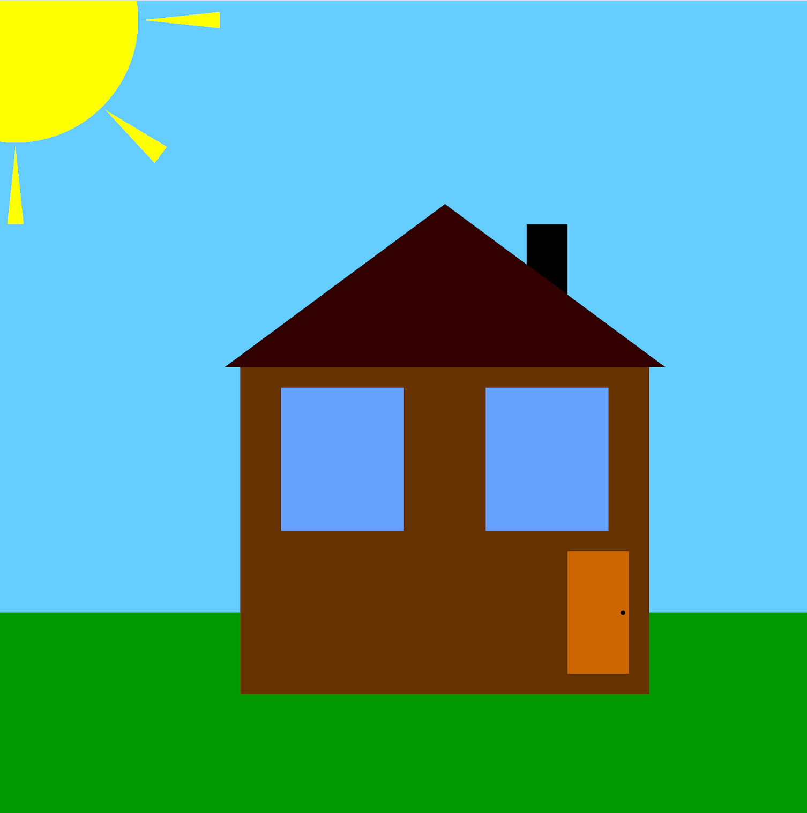
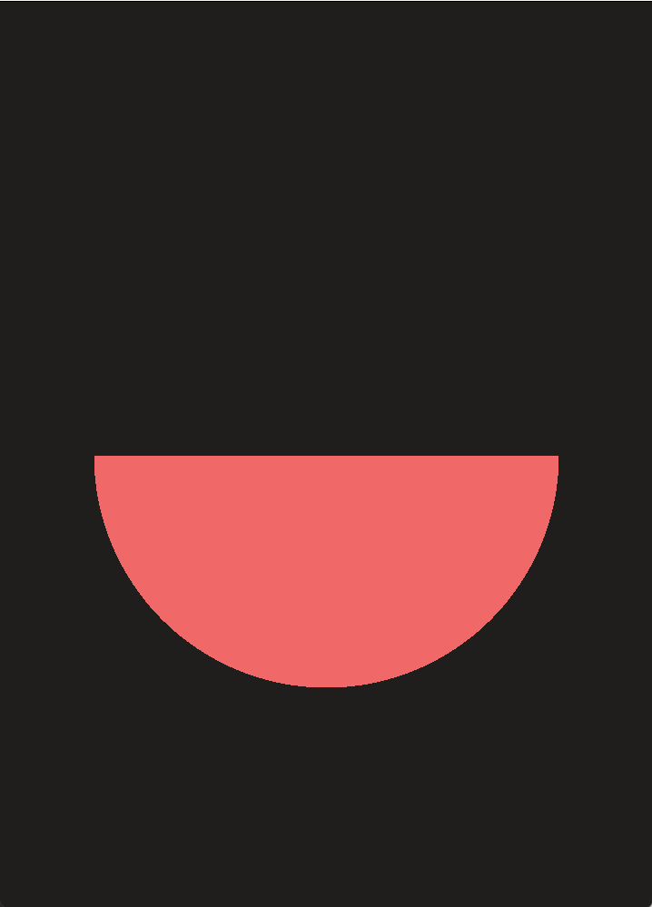
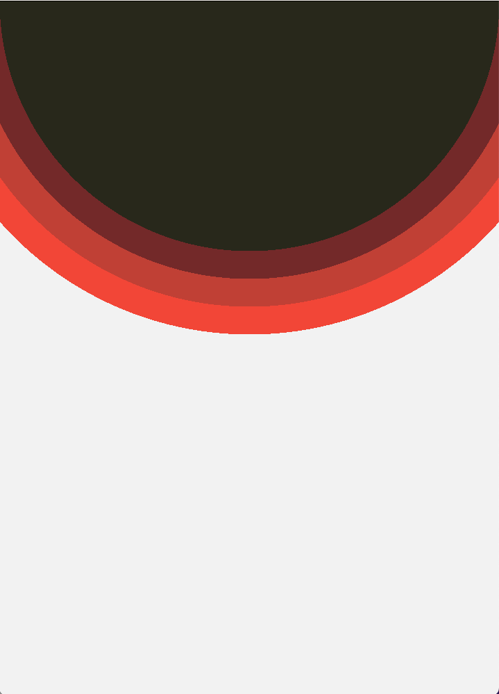
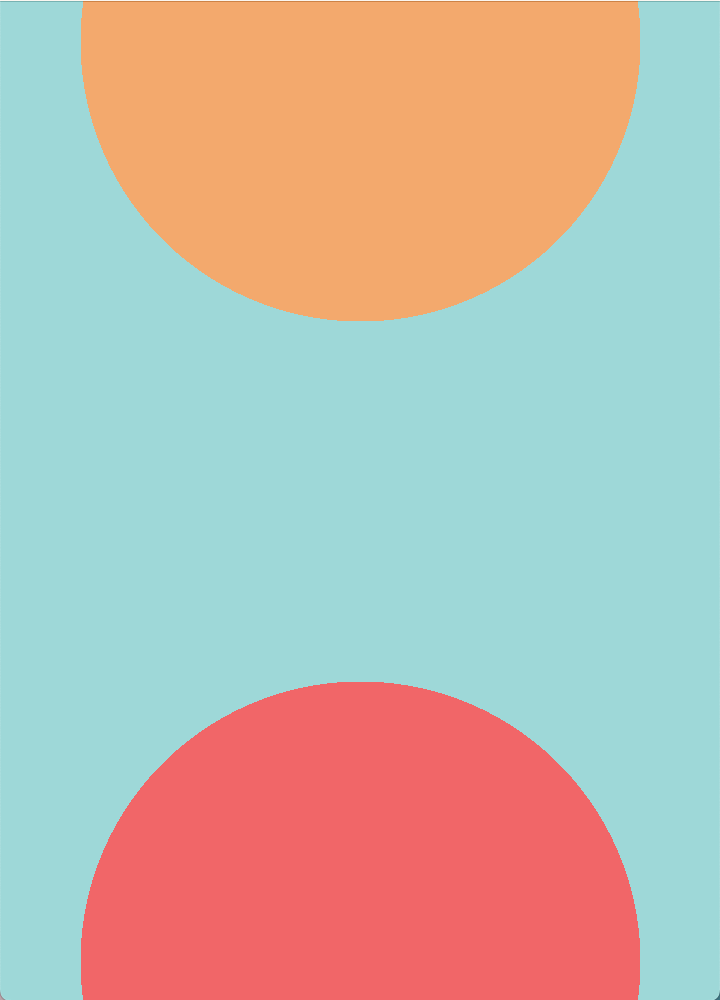

# Object-oriented programming course

## Practice
The source code from practice lessons you can find in the `practice` folder.

You may want to 

## Pictures examples

### Classes examples

| Mushroom  | House |
| ------------- | ------------- |
|  |  |

### Abstraction

| Semi Circle  | Concentric Suns | Two Dots |
| ------------- | ------------- | ------------- |
|  |  |  |

### Text

| Alex |
| ------------- |
|  |
