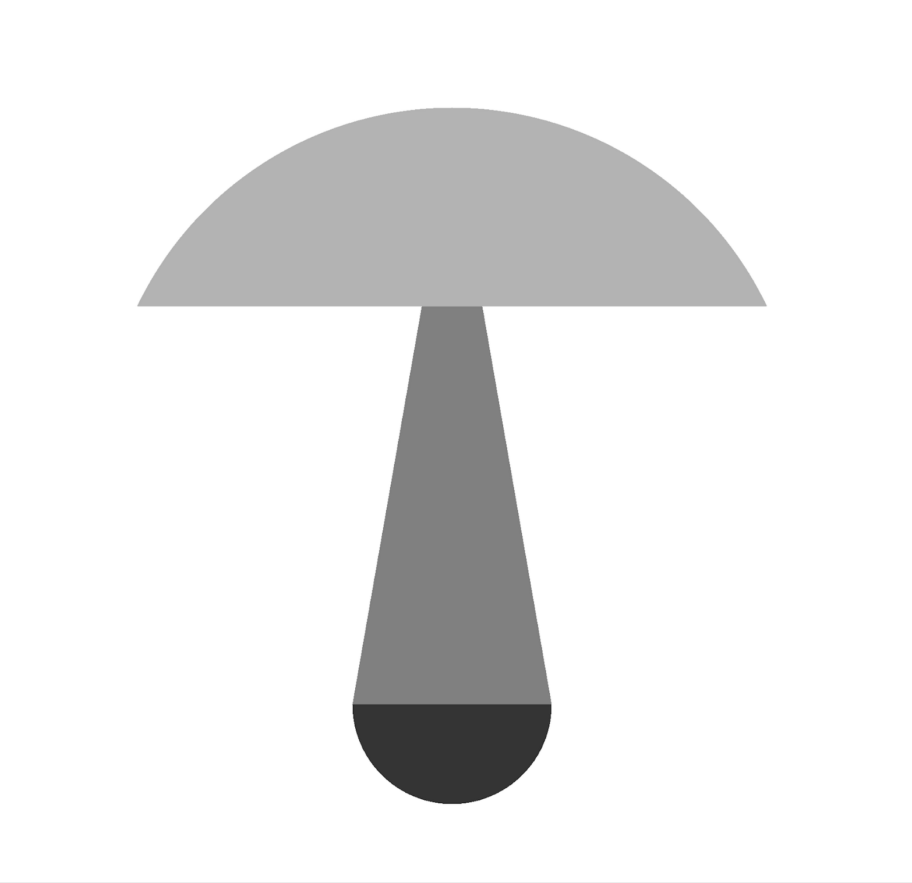
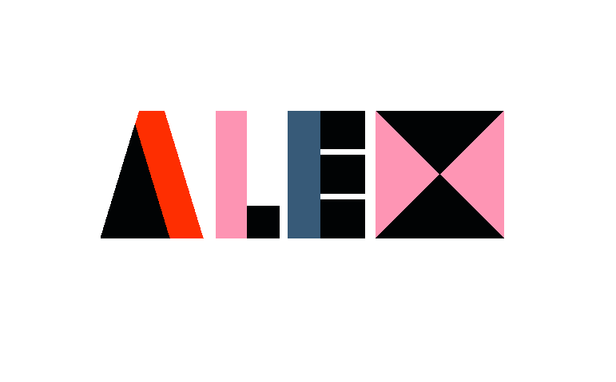

# HSE. Object-Oriented Programming. C++ Final Project.

Hello my fellow classmates 👋

## Build

You have to have [OpenCV installed](https://docs.opencv.org/4.x/d7/d9f/tutorial_linux_install.html) on your computer.

From `src` folder:

```
mkdir build
cd build

cmake ..
make -j7

./bin/runner
```

## What will you see?

The project structure is quite basic and exactly the same as was introduced in the course.

The main folder is the `project` folder. You will find two subfolders there: `include` with headers and `src` with implementations.

You may find that the following logic has been implemented there:

- Color: the abstract color class. Treats all colors as unsigned 32 bits integers. Provides two methods: deepCopy and getValue.
  - RgbColor: treats colors as unsigned 32 bits integer: bits [0-7] are unused (can be potentially used for alpha channel), bits [8-15] are for Red channel, [16-23] are for Green, and [24-31] are for Blue.
  - BwColor: uses the same 32 bits integers, however, vast majority of bits are unused, except [16-23].
- Shape:
  - Circle: takes square area around the center and checks if a dot from this area is within the circle;
  - Rectange: consists of 2 triangles, and delegates rendering calls to triangles;
  - Triangle: uses the [sweep lines algorithm](https://en.wikipedia.org/wiki/Sweep_line_algorithm) to render a triangle. The algorithm fills the triangle row-by-row (row is a horizontal row of pixels).
- RenderingUtils: the main utility in the project. Provides methods to "draw" circles, rectanges, and triangles, described above.
- Point: 2d vector.

## Test samples

This section provides code samples to draw images. You can use it to either check my implementation or test/compare yours.

### Default set

This is basic examples from the class.

| Mushroom  | House |
| ------------- | ------------- |
| [](examples/mushroom/code.cpp) | [](examples/house/code.cpp) |

### Abstractions set

I took the liberty of providing more examples to test the code. Hopefully, you'll find them useful.

| Semi Circle | Two Dots |
| ------------- | ------------- |
| [](examples/semi_circle/code.cpp) | [](examples/two_dots/code.cpp) |

| Motion | Concentric Suns |
| ------------- | ------------- |
| [](examples/motion/code.cpp) | [](examples/concentric_suns/code.cpp) |

### Text set

This test sample was a nightmare, therefore this is the only test in this set 😅

| Alex |
| ------------- |
| [](examples/alex/code.cpp) |
